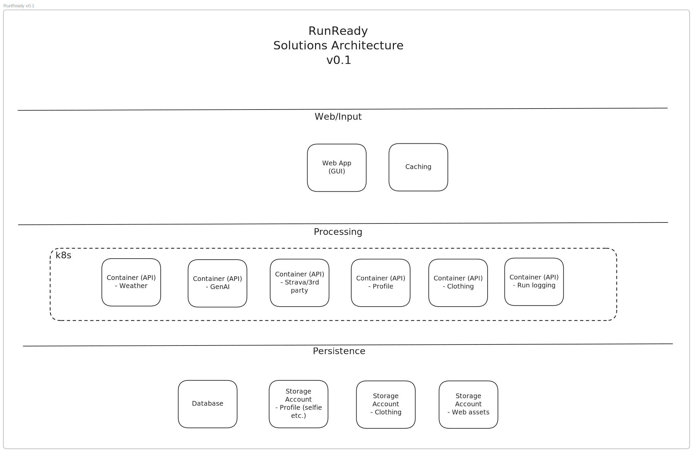

# RunReady
*Dress Smart. Run Better.*

## Mission
RunReady eliminates the guesswork from running apparel selection by providing personalized, AI-driven clothing recommendations that adapt to weather conditions, personal preferences, and individual comfort history - helping runners of all levels dress smart and perform better.

## Architecture

## The Problem
- Runners struggle with appropriate clothing selection for varying weather
- Temperature perception changes seasonally 
- Long runs involve changing conditions across routes
- Poor choices lead to discomfort and performance issues

## The Solution
A smart platform providing optimal running clothing recommendations based on:
- Current and forecasted weather conditions
- Personal clothing preferences  
- Historical comfort feedback
- Run-specific factors (distance, terrain, intensity)

## Project Status
🚧 **Phase 1: Infrastructure Foundation** - Setting up Azure cloud infrastructure with Terraform

## Tech Stack
- **Infrastructure:** Azure + Terraform
- **CI/CD:** GitHub Actions
- **Development:** TBD

## License
MIT License - See LICENSE file for details